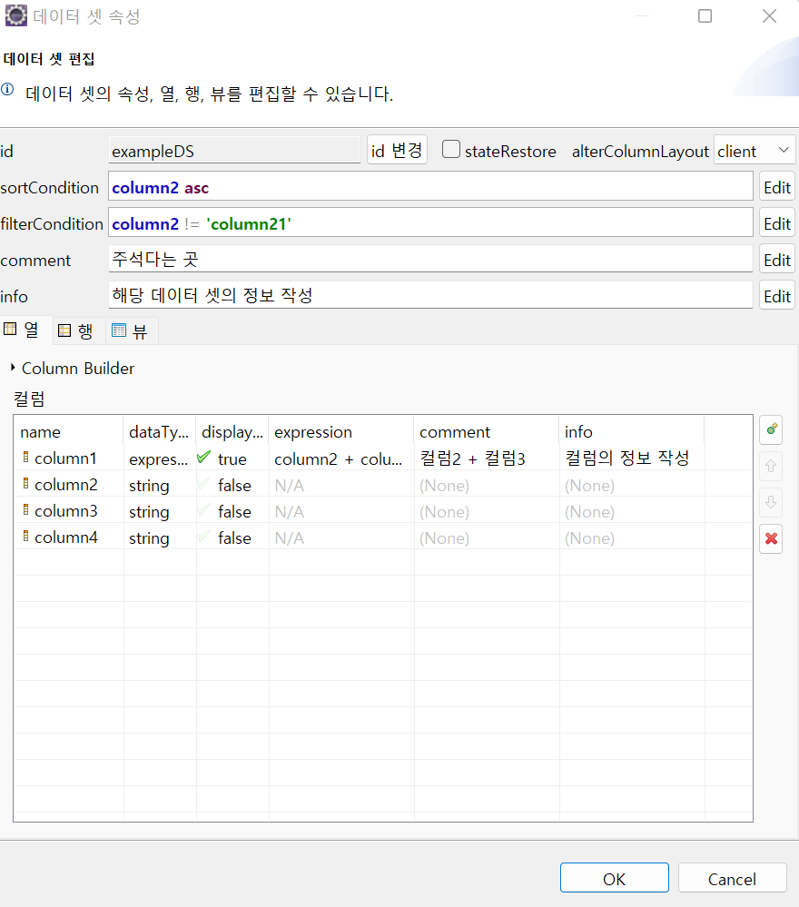
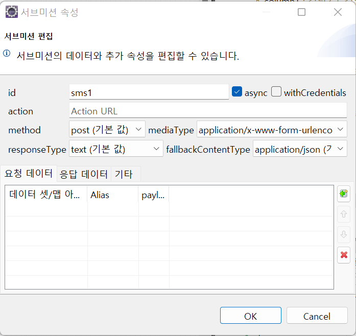
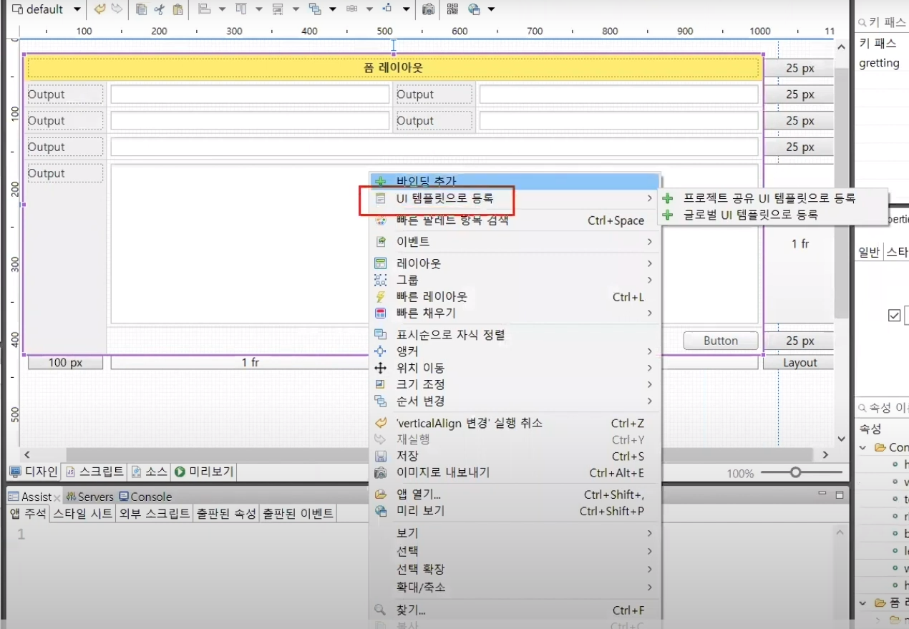
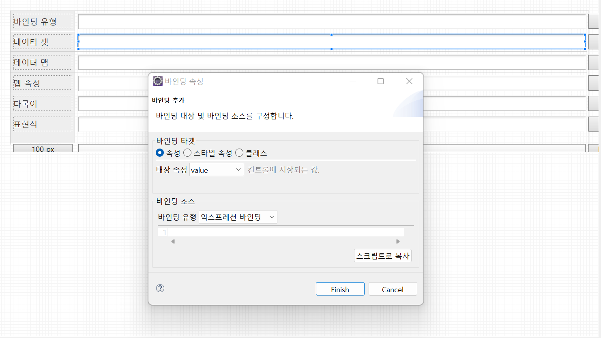

# eXBuilder6 기본교육

>## 1. UI 프로젝트 구조 설명

- 모든 작업은 src 폴더에서 이루어 진다.

       --- clx-src
        |
        |--/theme
        |--/udc
        |--env.json
        |--language.json
        |

### 1.1 theme

- controls 폴더 안에 part.less 파일이 존재
- 각 커트롤들의 스타일을 어떻게 적용할지 관리
- 클래스명에 cl이 붙어서 생성된다.
- Ctrl+ Space
- cleopatra-theme.less파일에 import된 파일들은 build 폴더에 하나의 css 파일로 컴파일

### 1.2 udc

- User Define Control
- 사용자가 직접 컨트롤을 조합해서 만들때, udc 폴더 아래에 생성

### 1.3 env.json

- 런타임 환경설정 파일
- 외부 라이브러리, 외부 스타일 시트에 대한 url 작성시 외부 스크립트 사용가능

### 1.4 language.json

- 스튜디오에서 사용하는 다국어 파일

```json
{
	"ko": {
		"greeting": "안녕하세요, eXBuilder6!"
	},
	"en": {
		"greeting": "Hello, eXBuilder6!"
	},
	"ja": {
		"greeting": "こんにちは、eXBuilder6！"	
	}
}
```

- 새 exbuilder6 파일 생성시 빌드된다.
- 스크립트를 작성할 시 스크립트 탭으로 이동하여 작성.

<br>

<br>

---

>## 2. 컨트롤 배치 방법 및 편집기 뷰 설명

- 디자인
- 스크립트
- 소스
- 미리보기

### 2.1 디자인

- exbuilder6에서 제공하는 컨트롤들이 있는 탭

### 2.2 스크립트

- 스크립트를 작성하는 탭

### 2.3 소스

- xml파일이며 디자인탭에서 설정한 내용이 xml 소스로 컴파일 되는 것
- 수정은 디자인 탭에서 하는 것을 권장

### 2.4 미리보기

- 디자인 된 컨트롤 미리볼 수 있음

<br>

---

>## 3. Properties

### 3.1 일반 탭

- 가장 바깥 쪽의 화면을 클릭하면 루트 컨테이너로 선택된다.
- 앱 폴더는 clx 파일이다.
	- 파일의 title은 default로 파일명이 지정된다.
	- title에 값을 입력한 뒤 저장하면 공유할 수 있도록 제목이 설정된다.
	
- Ctrl + Shift + , 를 눌러서 앱 열기 창을 열 수 있다.
	- 앱 열기 검색창에 검색어 입력시 clx 파일이 검색된다.
- Properties 탭에서 값을 변경할 수 있다.
- ...을 누르면 모달창이 나오는데 모달창을 이용해 보다 자세히 설정이 가능하다.

### 3.2 스타일 탭

- 스타일 탭을 선택하여 css 속성을 변경할 수 있다.
- part.less 파일에서 적용한 스타일보다 스타일탭에서 적용한것의 우선순위가 높다.
	- !important 속성과 비슷


### 3.3 레이아웃 탭

- XY 레이아웃은 exBuilder6에서 기본적으로 사용되는 레이아웃
- 각각의 컨트롤을 클릭하면 설정된 값이 변경된다.

### 3.4 이벤트 탭

- 현재 선택된 컨트롤 기준으로 이벤트를 보여준다.
- 이벤트 추가하는 방법(2가지)
	- 마우스 우클릭 이벤트탭
	- 이벤트탭에서 원하는 이벤트 더블클릭하면 스크립트가 나타난다.
	- 스크립트 왼쪽에 나타나는 버튼을 클릭하면 해당 이벤트가 걸려있는 컨트롤로 이동하게 된다.
- 가장 많이 사용하는 이벤트는  Enter 키를 통해서 부여할 수 있다.

### 3.5 사용자 속성

- 컨트롤에 존재하는 속성이 아닌 사용자가 직접 속성을 추가할경우 사용한다.
	- 컨트롤 사용자 속성
	- DOM 데이터 속성

<br>

---

>## 4. Assist 뷰 설명

- 입 주석: 앱 주석을 지정할 수 있다(검색 가능)
- 스타일 시트 && 외부 스크립트: 소스경로 안에있는 스타일, 외부 스크립트를 추가할 수 있다.
- 출판된 속성 && 출판된 이벤트ㅣ 다른 파일에서 임베디드할 경우 사용할 수 있다.

<br>

---

>## 5. Outline 뷰 설명

- 배치한 순서대로 Outline 뷰에서 확인
- 브라우저의 Tab 인덱스 순서를 지정할 수 있다.
- Comment 속성에 값을 입력할 경우 디자인 탭에서 마우스 오버시 확인가능
- 눈 모양 클릭시 가시/비가시 모드
- 아웃라인에서 준 속성들은 디자인 탭에서만 유효하고, 브라우저에서는 유효하지 않다. 브라우저에 적용할 경우 Properties 탭에서 값을 변경.

<br>

---

>## 6. Model

### 6.1 앱 속성

- Assist에서 출판된 속성에 있는것을 나타내며, 보기만 가능하다.

### 6.2 데이터 셋

- 복수의 column과 row를 가진 `데이터 컨트롤`
- 그리드 컨트롤과 가장 많이 사용된다.
- 콤보박스, 트리와 같은 목록형 컨트롤들의 value를 나타낼때 사용한다.
- cloumn, row를 탭을 클릭하여 추가하지만, 일반적으로 row는 추가할 일이 적다.

#### 6.2.1 colunm

- 컬럼의 `name`은 DB에서 가져오는 이름과 동일해야한다.(대소문자 구분)
- 컬럼의 `dataType`은 `string`, `number`, `decimal`, `expression` 4가지가 존재한다.
    - expression 타입일 경우에 expression 속성을 편집할 수 있다.
    - expression 타입은 client에만 존재하는 column이다.(표, 제목)
    - expression 속성 편집창에서 ctrl + space를 눌렀을경우 어시스트 창을 볼 수 있다.
    - ex)expression을 추가한뒤 row 탭에서 추가할 경우 확인이 가능하다.
- 컬럼의 `comment`는 스튜디오에서 확인할 수 있는 주석이다.
- 컬럼의 `info`는 해당 컬럼에 대한 정보를 작성한다.
- 열 탭의 Column Builder는 DB와 연동해서 SELECT문을 이용해 Column명을 가져올 수 있다.
    - 직접 타이핑하면 번거롭다.



- sortCondition 탭은 로드되는 데이터를 정렬하기 위해 사용한다.
    - 정렬방법을 각각 지정할 수 있음
         - ex) column2 asc
         - ex) column2 desc
- filterCondition에서 수식을 작성하여 필터링
- comment는 주석을 작성할 수 있는 곳
- info는 해당 데이터 셋의 정보를 작성 할 수 있는 곳.


### 6.3 데이터 맵

- 데이터 맵은 ctrl+enter로 생성할 수 있고 더블클릭시 편집창이 띄워진다.
- 데이터 셋과 인터페이스가 비슷하며 기능도 같다.
- 데이터 맵은 복수의 컬럼 && 각각 하나의 값만 가지고 있다.

### 6.4 서브미션

- ajax 통신을 속성창으로 만듬



- 다음의 속성들을 각각 원하는 대로 설정하면된다.
    - action: requestMapping 주소
    - method: http 메서드
    - mediaType: aplication/json과 같은 속성 (defalut form 데이터)
    - responseType: 응답 타입
    - fallbackContenteType: aplication/json과 같은 속성

- 요청 데이터
    - 클라이언트에서 어떤 데이터셋, 맵을 보낼지

- 응답 데이터
    - 서버에서 어떤 데이터셋, 맵을 보낼지

데이터를 전송하기 위해서는 다음의 스크립트를 작성해야한다.
반드시 send 메서드를 사용해야 전송을 할 수 있다.
```js
function onButtonClick(e){
	var button = e.control;
	
	// 서브미션 객체 찾기
	var sms = app.lookup("sms1");
	
	// 서브미션 전송
	sms.send();
}
```

<br>

---

>## 7. Language 뷰

- help => help contents => 국제화 검색후 사용가능

<br>

---

>## 8. Palette 뷰

- 디자인탭에서 `ctrl + space`로 빠른 팔레트를 사용할 수 있다.

<br >

<br >

<br >

<br>

---

>## 9. 레이아웃

### 9.1 XY레이아웃

### 9.2 반응형 XY 레이아웃

- 반응형 웹을 만들때 사용한다.
- 각 사이즈 데스크탑, 태블릿, 모바일, 커스텀 사이즈 별로 크기를 지정할 수 있다.

### 9.3 폼 레이아웃

- form

### 9.4 버티컬 레이아웃

- 위에서 아래로 배치되는 레이아웃

### 9.5 플로우 레이아웃

- lineWrap 속성으로 개행 허용 여부를 설정
-  

<br>

---

>## 10.Templates로 지정

- 자주 사용하는 화면 배치는 Templates으로 설정하여 사용 가능
- 레이아웃 선택 후 UI 템플릿으로 등록버튼 클릭



- 글로벌 UI 등록시 다른 모든 프로젝트에서 템플릿 사용가능
- 프로젝트 공유 UI로 등록시 현재 프로젝트에서 템플릿 사용가능

- template 폴더에 eXBuilder6 파일을 만들었을 경우 해당 파일의 레이아웃을 다른 파일을 생성할 경우 사용할 수 있다.
    - 자주 사용하는 레이아웃을 만들어두어 사용한다.


<br>

---

>## 11.바인딩

- `바인딩`은 외부의 값을 가져와서 속성 또는 스타일에 갑을 연결해서 출력할 때 사용
- 컨트롤 클릭 => 우클릭 => 바인딩 추가 항목을 선택 or Properties 뷰의 바인딩 탭 추가
    - 초록색 아이콘은 바인딩 불가
    - 파란색 아이콘은 바인딩 가능



- 위의 바인딩 속성창은 타겟과 소스로 나뉜다.
    - 타겟은 어느 속성에 넣을건지
        - 속성(ex. placeholder)
        - 스타일 속성(ex.value, color)
        - 클래스
    - 소스는 어디서 온것인지
        - 데이터 셋 바인딩
        - 데이터 맵 바인딩
        - 앱 속성 바인딩
        - 다국어 바인딩
        - 표현식(expression) 바인딩

<br>

---

>## 12. 기본 컨트롤

### 12.1 출력 계열(아웃풋)

- String
- Number
- Date
    - dateValueFormat

### 12.2 인풋 게열

- 인풋박스
    - secret: true일 경우 비밀번호
- 서치인풋(돋보기 버튼)
- 넘버에디터: 숫자값만 입력할 수 있는 컨트롤
    - min, max 값과 step을 줄 수 있다.
- 데이트인풋: 달력 컨트롤
- 마스크에디터: 전화번호 같이 지정된 값을 사용할 경우
- 파일인풋: 파일 넣을 경우 사용
- 텍스트에리어: 두 줄 이상의 값을나타낼 때 사용한다.

### 12.3 셀렉션 게열

- 콤보박스
- 링크드 콤보박스
    - 자식 아이템이 있을경우 사용
- 리스트박스
    - 리스트 형태
- 링크드 리스트 박스
    - 자식이 있는 리스트 형태
- 체크박스
- 체크박스그룹
- 라디오버튼

---

<br>

### 13. 그리드