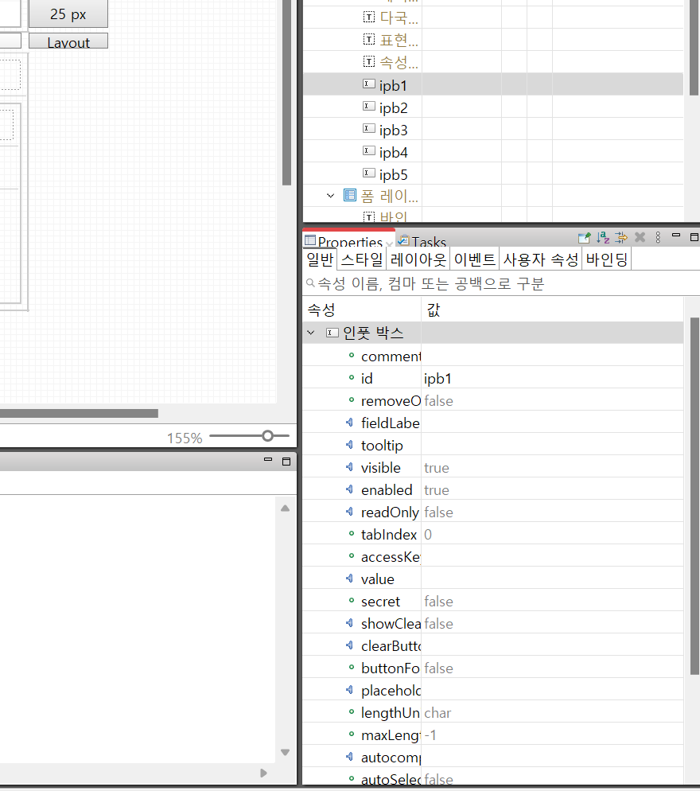
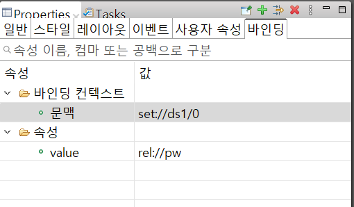
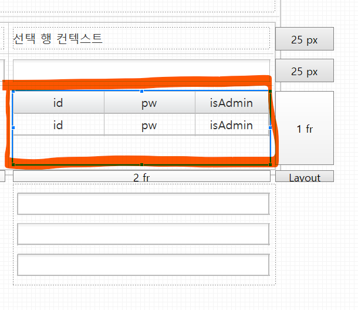

# 바인딩

 

외부의 값을 가져와(fetch 등) 속성, 스타일에 값을 연결해서 출력할 때 사용

 

## 바인딩 추가

 

컨트롤(컴포넌트) 클릭 > 마우스 우클릭 > 바인딩 추가 항목 선택

or

Properties 뷰의 바인딩 탭에서 바인딩을 추가

 

파란색 소켓 아이콘이 있는 속성에서 우클릭 했을 경우 바인딩 항목을 볼 수 있다.

(파란색 소켓 아이콘이 있어야 바인딩이 가능)

 

 

1. `바인딩 타겟`은 어느곳에 바인딩 할 것인지 지정하는 곳

- 속성: 일단 탭의 파란색 소켓에 있는 속성과 동일
- 스타일 속성: 루트 스타일러와, clearStyle이 존재(대상 속성의 오타 주의).
- 클래스

 

2. `바인딩 소스`는 어디에서 값을 가져올지 지정하는 곳

- 바인딩 유형에서 선택하여 사용이 가능
    - 데이터 셋 바인딩
    - 데이터 맵 바인딩
    - 상대 컬럼 바인딩
    - 앱 속성 바인딩
    - 다국어 사전 바인딩
    - 익스프레션 바인딩

 

 

>### 바인딩 추가(데이터 셋 바인딩)

원하는 데이터 셋(id), 행, 열을 지정하여 값을 바인딩

일반 탭의 value 속성에 값이 지정된 것을 확인할 수 있음

 

>### 바인딩 추가(데이터 맵 바인딩)

원하는 열을 선택하면 그 열에 해당하는 키의 값을 바인딩

 

>### 바인딩 추가(앱 속성 바인딩)

Assist 탭의 출판된 속성이 앱 속성으로 나타남

 

>### 바인딩 추가(다국어 사전 바인딩)

다양한 다국어가 존재할 경우에 키 패스를 선택

 

>### 바인딩 추가(익스프레션 바인딩, 표현식)

익스프레스 바인딩에는 표현식을 작성할 수 있음

작성칸을 선택한 뒤 `Ctrl + Space`를 누르게되면 표현식에서 사용가능한 속성, 함수듣이 열거

텍스트는 큰 따옴표("")를 사용, 수식은 숫자를 사용하면 된다.

브라우저 창을 켜서 적용이 되었는지 확인할 수 있음

※.HelpContents에 *표현식*을 검색하면 사용할 수 있는 연산자, 함수들을 확인할 수 있다.

 

>### 바인딩 추가(상대 컬럼 바인딩)

상대 컬럼 바인딩은 어느 영역을 참고할 것인지 `컨텍스트 영역`을 가장 먼저 지정해야한다.

지정하지 않으면 위와 같이 아무것도 나타나지 않는다.

Properties 탭의 바인딩 항목을 선택하여 바인딩 컨텍스트의 **문맥**을 더블클릭

문맥 유형에는 세가지 선택지가 있다.
- 데이터 로우 컨텍스트: 데이터 셋에서 가져옴
- 데이터 맵 컨텐스트: 데이터 맵에서 가져옴
- 선택 행 컨텍스트: 컨트롤에서 값을 가져옴

#### 데이터 로우 컨텍스트

바인딩 추가창을 열면 열부분을 클릭한 뒤 `Ctrl + Space`를 입력

원하는 값을 선택한뒤에 Finish하면, 값이 추가된 것을 확인할 수 있다.

#### 데이터 맵 컨텍스트

마찬가지로 바인딩 추가창을 열면 열부분을 클릭한 뒤 `Ctrl + Space`를 입력

원하는 값을 선택한뒤에 Finish하면, 값이 추가된 것을 확인할 수 있다.

#### 선택 행 컨텍스트

가장 많이 사용하는 바인딩 유형

영역에 표시된 그리드의 Properties 속성을 보면,

dataSetId에 ds1이 연결된 것을 확인할 수 있다.

화면 중간에 그룹 + 인풋 박스를 추가한 뒤에 그룹 컨트롤의 바인딩 탭의 문맥에 선택 행 컨텍스트 속성을 적용

오른쪽 상단의 Model 탭을 클릭해서 연결된 데이터 셋의 값들을 드래그 앤 드롭

브라우저를 열어서 확인하면 선택되지 않았을 경우에는 값이 출력되지 않으나,

임의의 값을 클릭을 하게되면 클릭한 그리드의 값들이 인풋박스에 렌더되는 것을 확인할 수 있다.

선택할 때마다 값을 다르게 보여줄 경우 사용하는 바인딩

 