# grid

## grid 생성하기

그리드에 데이터를 나타내기 위해서는 데이터 셋을 만들어야한다.

그리드에 데이터 셋을 연결하기 위해서 데이터 셋을 드래그 앤 드롭해준다.

다음과 같이 생성옵션창을 확인할 수 있다.

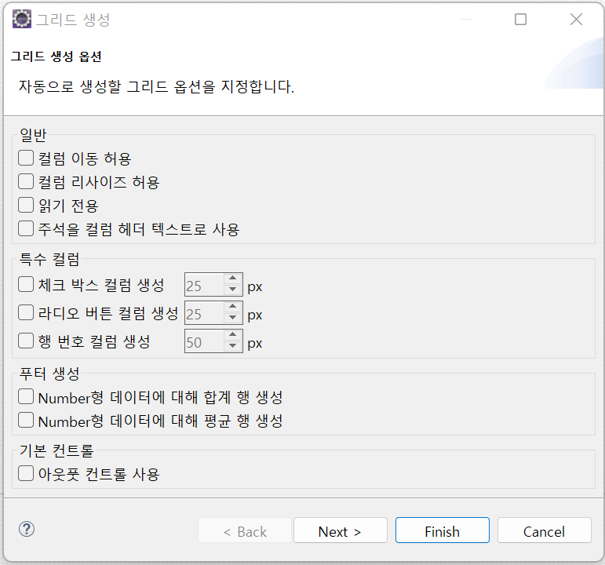

- 일반
    - 컬럼 이동 허용 : 그리드의 컴럼간 이동을 허용할 것인지 여부
    - 컬럼 리사이즈 허용 : 지정된 너비보다 크거나 작게 보여지게 할 수 있는지
    - 읽기 전용 : 그리드의 편집 여부
    - 주석을 컬럼 헤더 텍스트로 사용: 데이터 셋에 입력한 comment를 헤더 텍스트에 사용할 지 여부

- 특수 컬럼
    - 체크 박스 컬럼 생성: 로우의 체크 여부를 설정하는 컴럼을 생성
    - 행 번호 컬럼 생성: 로우 인덱스를 출력하는 컬럼을 생성

- 푸터 생성
    - Number형 데이터에 대해 합계 행 생성
    - Number형 데이터에 대해 평균 행 생성

 

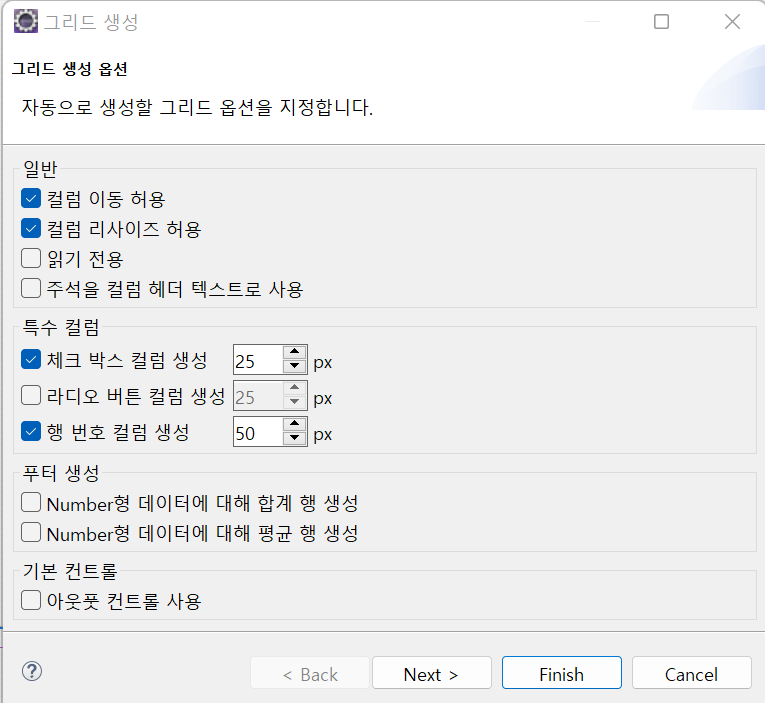

위와 같이 체크한 뒤에 `Next >`를 클릭해보자.

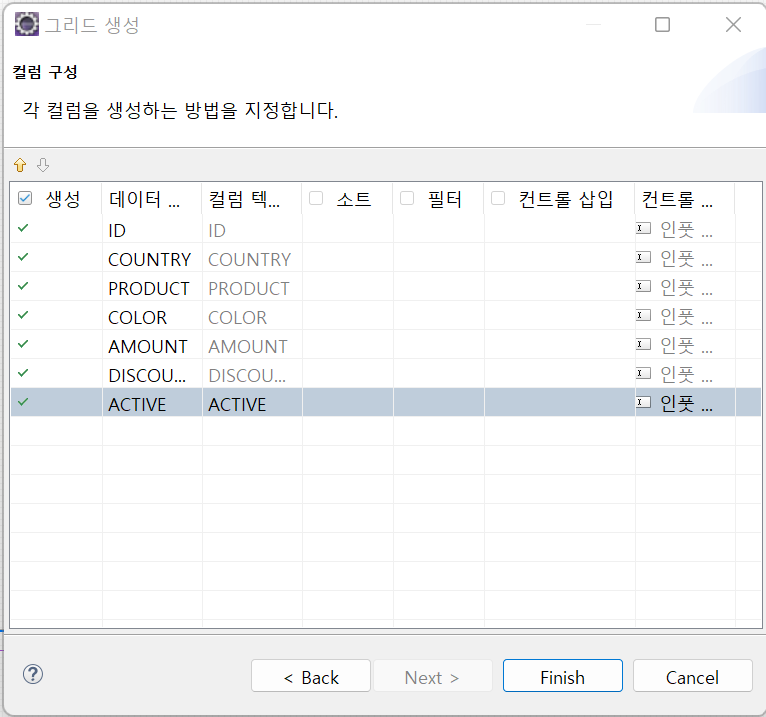

- 생성: 생성여부
- 데이터 컬럼: 컬럼명
- 컬럼 텍스트: comment 값으로 지정(없을경우 defalut값으로 데이터 컬럼)
- 소트
- 필터
- 컨트롤 삽입: 해당 그리드에 삽입할 컨트롤을 선택
- 컨트롤 타입

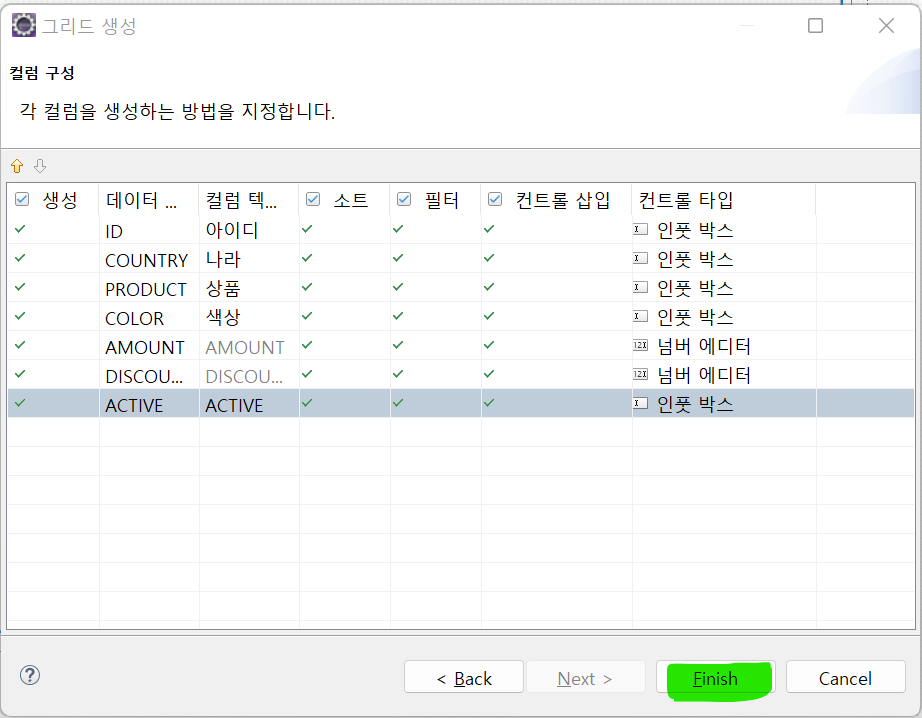

Finish를 클릭하여 생성

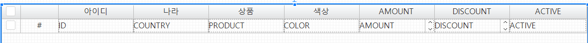

체크박스, 로우 인덱스를 그리드 탭에서 `+`버튼으로 추가할 수 있음

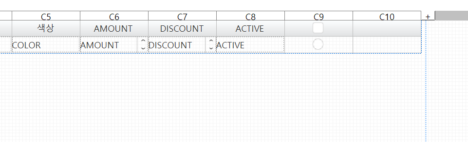

각 열의 너비는 아래에서 설정이 가능하며, **autoFit**을 통해 자동 조정도 가능하다.

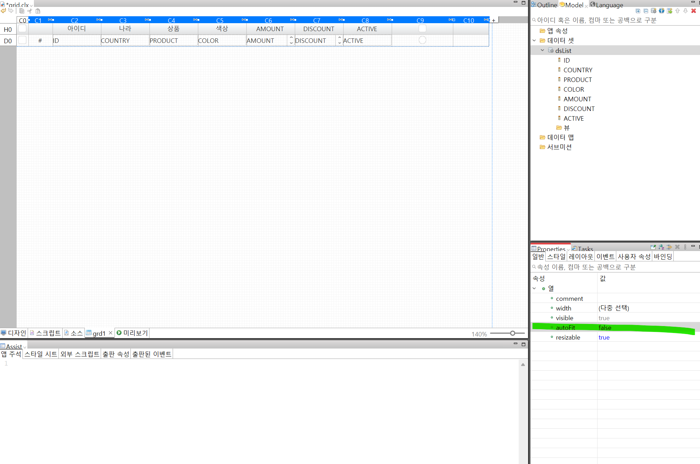

**autoFit** 속성을 통해서 비어있는 공간을 채울 수 있으며, 일반적으로 행 번호나 체크박스의 너비를 고정시키고 데이터가 나타나는 곳은 **autoFit**으로 설정한다.

아까 체크했던 부분은 브라우저 화면에서 컬럼이동, 리사이징 등이 동작하는 것을 확인할 수 있다.

- resizable, movable과 같은 속성으로 지정할 수 있다.

 

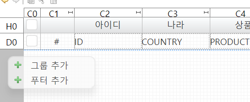

위에서 보이는 H0은 헤더 영역, D0은 디테일 영역을 나타낸다.

마우스 우클릭을 통해서 푸터를 추가할 수 있다.

푸터 영역에 합계(getSum)와 평균(getAvg)를 이용해서 값을 나타낼 수 있다.

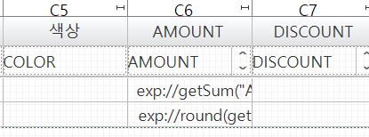

푸터 영역을 더블클릭하여 표현식을 작성한다.

 

 

## grid-split

표의 일부분을 고정시킨뒤에 나타낼 수 있다.(엑셀 행/열 고정 기능)

Properties의 split을 검색해보자.

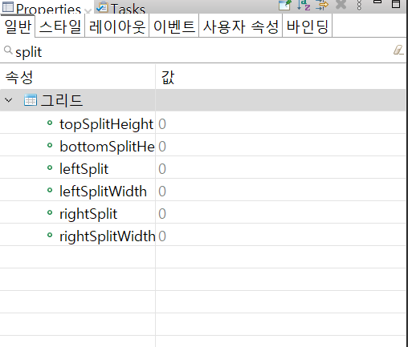

- leftSplit, rightSplit은 헤더 기준으로 몇번째 컬럼까지 고정할 것인지 정하는 속성이다.
- topSplit과 bottomSplit은 데이터의 행의 갯수를 알 수 없기 때문에 속성탭이 아닌 스크립트에서 작성해야한다.

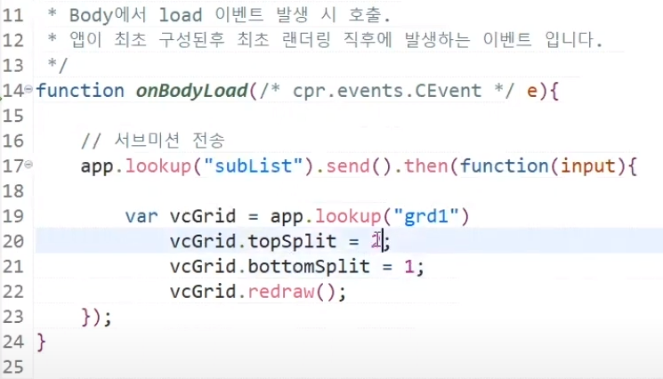

- topSplitHeight, bottomSplitHeight
- leftSplitWidth, rightSplitWidth