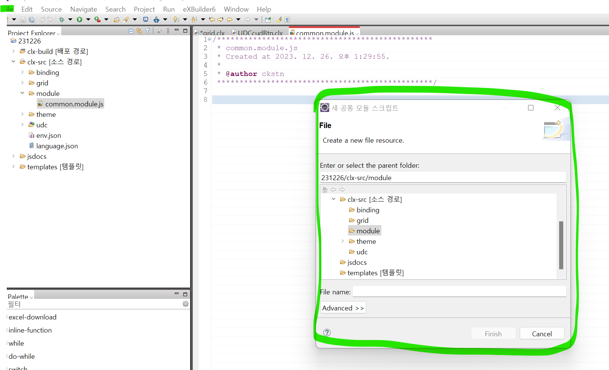
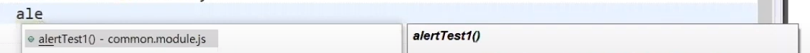

# 공통모듈

- 공통적으로 많이 사용되는 속성이나 메서드를 작성하여 여러 화면에서 사용한다.(React Hook?)
- 출판이라는 과정을 거쳐서 사용을 할 수 있다.

## 모듈 생성하기

소스 경로에서 새 공통 모듈을 선택



common이라는 이름으로 module을 생성해보자.

<br>

<br>

## 모듈 출판하기

### 1. 글로벌 출판 방식

다음과 같이 globals 객체에 함수를 작성하면, 전역에서 접근할 수 있다.

디자인할 파일에 들어가서 `ctrl + space`를 이용해서 찾을 수 있다.



```js
globals.alertTest1 = function(){
    alert("test1");
}
```

`사용하기`

```js
clickHandler = () => {
    // 전역에 있으므로 가능
    alertTest1();
}
```

<br>

### 2. 모듈 출판 방식

특정 변수나 함수를 모듈의 멤버 변수 형태로 출판, 사용도 마찬가지로 멤버변수 형태로 사용한다.


다음과 같이 함수를 작성한 뒤에 모듈을 내보낸다.

```js
function alertTest2(){
    alert("test2");
}

exports.alertTest2 = alertTest2;
```

`모듈 가져오기 및 사용하기`

모듈을 가져올 때는 해당 모듈이 있는 경로를 알맞게 지정해줘야하는 듯하다.

```js
var moduleVar = cpr.core.module.require("common")

moduleVar.alertTest2()
```

<br>

### 3. 오브젝트 출판 방식

```js
var tmt = function(){};

tmt.prototype.alertTest3 = function(){
    alert("test3");
}

globals.alertTest3 = function(){
    return new tmt();
}
```

`사용하기`

```js
function onButtonClick3(e){
	var button = e.control;
	
	alertTest3().alertTest3();
}
```

<br>

### 4. 비표준 출판 방식

```js
tomatosystem = {
    alertTest4 : function(){
        alert("test"4);
    }
}
```

`사용하기`

```js
function clickHandler(){
    tomatosystem.alertTest4()
}
```
