# UDC(User Define Component)

사용자 정의 컴포넌트


## udc 생성

udc는 udc 디렉토리에서 생성해야한다.

udc 폴더에서 새 exBuilder6 파일 생성

파일을 열어보면 default 버튼이 있으며, 이를 클릭한다.

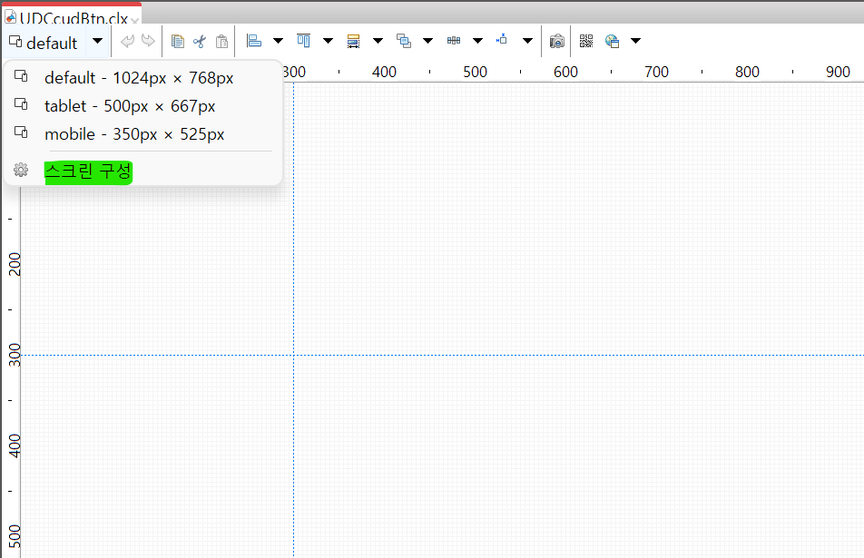

스크린 구성을 클릭하여

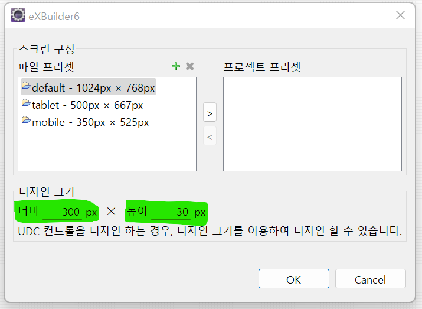

너비 300px, 높이 30px으로 지정한 뒤에 생성한다.

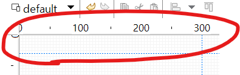

디자인 탭에서 크기가 지정되는 것을 확인할 수 있다.

레이아웃의 폼을 클릭하여, 3열 1행으로 구성한 뒤에 버튼을 추가해보자.

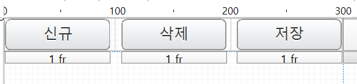

생성한 udc를 저장한 뒤에 이전에 작업했던 grid 파일을 연뒤에 palette 아래에 UDC를 클릭하여 컨트롤 추가하듯이 추가할 수 있다.

<br>

<br>

## udc에 이벤트 작성

신규, 삭제, 저장 버튼 각각에 이벤트를 작성해보자.


### 신규 버튼(행 추가)

- udc 파일에서 `신규`버튼을 클릭 후 엔터키를 눌러 붙여넣기를 한다.

**작성방법**

- udc를 사용하는 화면에서 그리드 컨트롤을 가져와야한다.
- udc 파일 안으로 그리드 컨트롤을 가져오기 위해서는 속성을 출판해야한다.

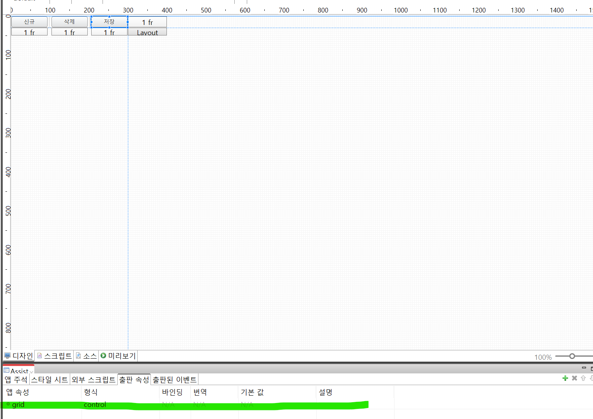

위와 같이 Assist 탭에서 속성을 출판한 뒤에, udc를 사용하는 grid 파일로 돌아가서 udc를 클릭하게되면,

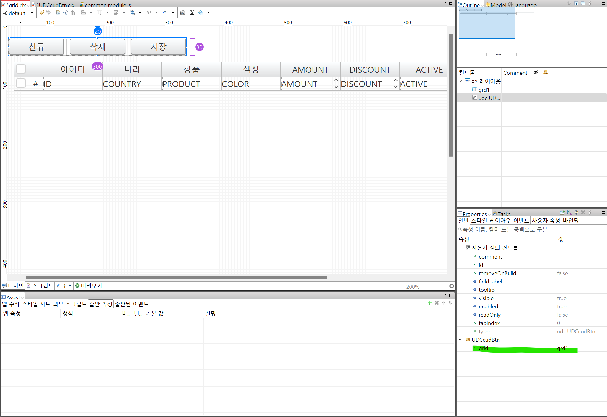

그리드 속성이 추가된 것을 확인할 수 있다.

탭의 속성에 추가된 그리드를 더블클릭하면 "..."버튼이 나타나고 이를 클릭해보자.

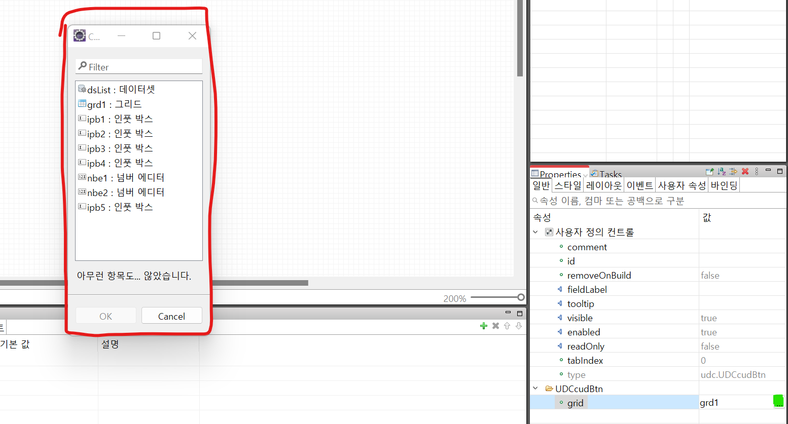

컨트롤 선택 창이 나타난다.

이 중에서 사용할 컨트롤은 grid이므로 grid를 선택한 뒤에 적용한다.

적용한 뒤에 다시 udc 파일로 이동한 뒤에 버튼을 클릭하고 이벤트를 작성해준다.

```js
function BtnClickHandler(e){
    /**
     * @type cpr.controls.Button
     */

    var btn = e.control;

    // ctrl + shift + / 로 타입을 지정한다.
    /** @type cpr.controls.Grid */
    var grd = app.getAppProperty("grid");

    // 행추가
    grd.insertRow(0, false);
}
```

<br>

### 삭제 버튼

삭제 버튼의 다음의 이벤트를 적용시킨다.

```js
function BtnClickHandler(e){
    /**
     * @type cpr.controls.Button
     */

    var btn = e.control;

    // ctrl + shift + / 로 타입을 지정한다.
    /** @type cpr.controls.Grid */
    var grd = app.getAppProperty("grid");

    // 삭제할 행의 Index
    var rowIndex = grd.getSelectedRowIndex();

    // 삭제
    grd.deleteRow(rowIndex);
}
```

<br>

### 저장 버튼

서브미션은 화면마다 어떤 명을 사용할지, 어떤 로직을 처리할 지 알 수 없다.

따라서 이벤트를 출판한 뒤에 각 화면에서 해당 이벤트를 작성한다.

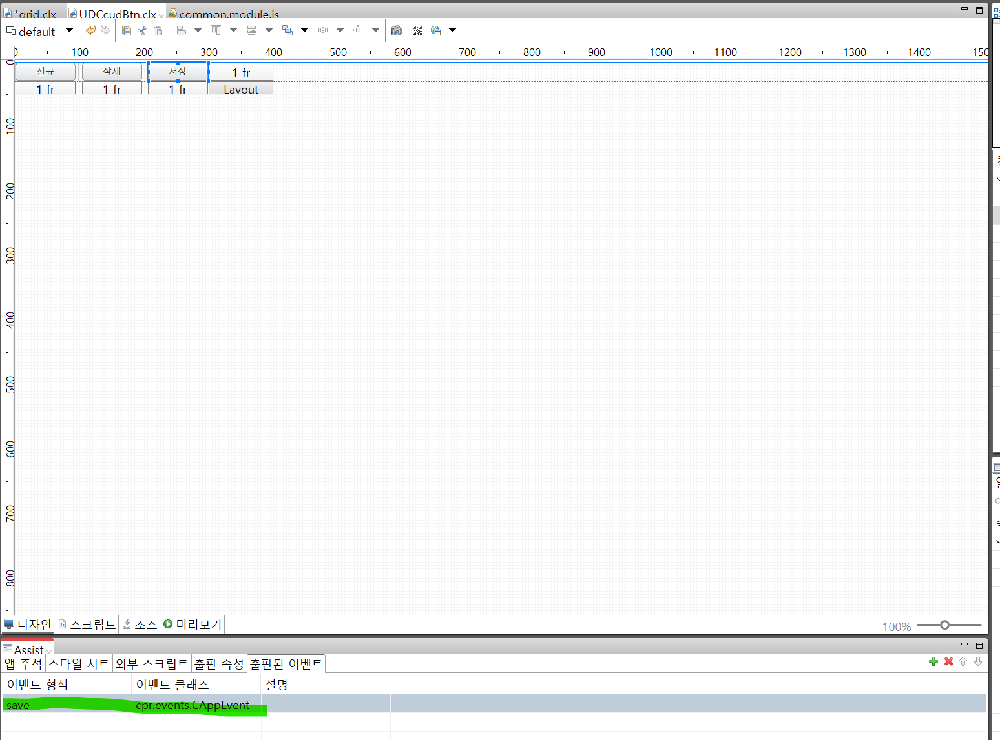

생성한 이벤트를 전파시키기 위해서 click 이벤트에 추가한다.

```js
function BtnClickHandler(e){
    /**
     * @type cpr.controls.Button
     */

    var btn = e.control;

    // 이벤트 생성
    var event = new cpr.events.CAppEvent("", options);

    // 이벤트 전파
    app.dispatchEvent(event);
}
```

작성한 뒤에 udc를 사용하는 grid 화면으로 넘어가서 마우스 우클릭을 하게되면,

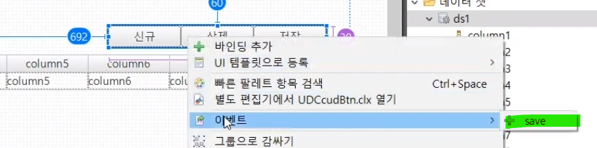

save 이벤트를 작성해보자.

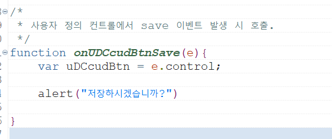

<br>

<br>

## 버튼 동작 확인

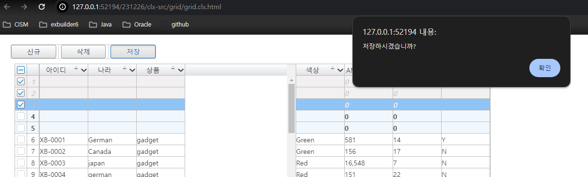

