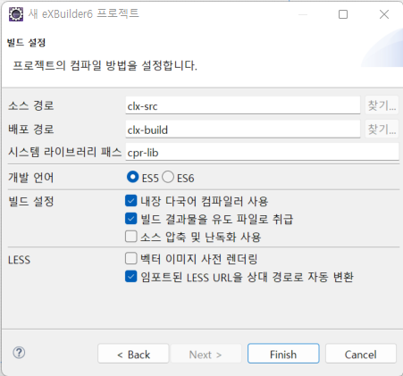
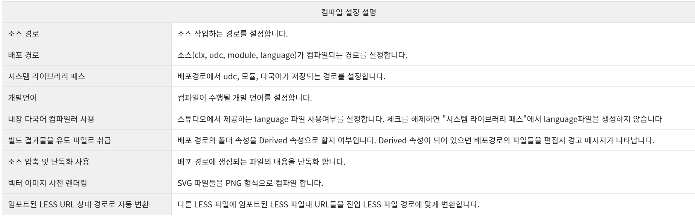

# eXBuilder6 조회 화면 만들기

## 프로젝트 구성





## 디렉토리 구조

```
src
 |-- /theme : eXBuilder6 기본스타일 폴더
 |-- /udc : 사용자 정의 컨트롤 관리 폴더
 |-- env.json
 |-- language.json
```

## 컨트롤

### 데이터 셋

- 데이터를 테이블 형태로 저장, 관리하는 데이터 컴포넌트
- Header, Column, Row로 구성
- 그리드를 통해 데이터를 표현, 라디오버튼, 체크박스 그룹, 콤보박스 등의 아이템 리스트에 바인딩
- 데이터 필터, 정렬이 가능
- 특정 데이터 셋을 소스로 별도의 필터 및 소트를 갖는 데이터 뷰를 여러개 가질 수 있음

### 데이터 맵

- Key-Value로 이루어진 데이터 컴포넌트로 행이 하나밖에 없는 데이터 셋과 유사
- Header, Column으로 구성되며 값이 누락된 경우에 대해 컬럼마다 기본 값을 가질 수 있다.
